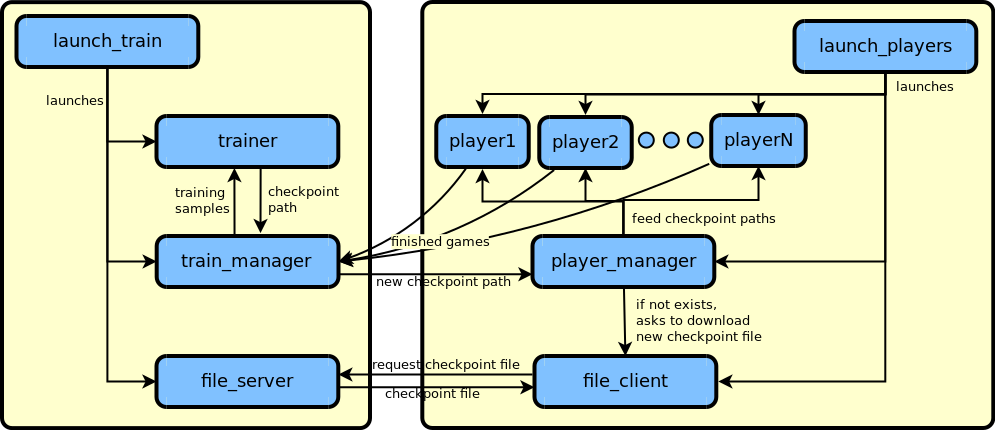

# Moku Zero

This is an implementation of Alpha Zero to solve the Moku game. Moku game is a
generalization of games where two players alternatingly put one piece on the
board, and the objective is to create a line of N pieces of the same color.
Examples of Moku games are: gomoku (5-in-a-row), tic-tac-toe and also
connect 4. It is ready to be used for any Moku configuration, but this code
should also be generic enough to be adapted to other similar board games
(e.g. reversi and go).

This code is developed for Python 3 and Tensorflow with Eager Execution. It
supports parallelism by running tasks on multiple processes, and it can also
be run on different computers on a local network.

The instructions in this guide are for bash in Linux. If you use another
environment, you may have to adapt them accordingly.

Notice we often include a `--gpu_id` argument, which corresponds
to the ID of the GPU to be used for that stage. If you have a single GPU,
use the ID 0 (zero), or simply omit the `--gpu_id` argument. If you do not
have a GPU, or want to just use the CPU, use the index -1 (minus one).

The flowchart below gives an overview of how the main components connect to
each other:



## Getting started

### Requirements

- [Python](https://www.python.org/) 3 (tested on Python 3.6)
- [Numpy](http://www.numpy.org/)
- [Tensorflow](https://www.tensorflow.org/) 1.9 or at least a build after
  [b202db0](https://github.com/tensorflow/tensorflow/commit/b202db076ecdc8a0fc80a49252d4a8dd0c8015b3).
  While it can work with Tensorflow 1.8, it is not recommended, as the Eager
  implementation had some memory leak problems which affect this code.

### Installation

1. If you do not have the requirements above, install them first, following the
    instructions provided by each package.

2. Clone this repository:
    ```bash
    git clone https://github.com/henriquem87/moku-zero.git
    ```

    We will refer to the directory generated by the clone operation as
    `moku-zero`. If you cloned the repository with another name, be sure to
    adapt the following instructions accordingly.

3. (Optional) Download some trained models.

    To understand more about the implemented ResNet models, check
    [net.py](net.py).

    [Tic-Tac-Toe model](https://drive.google.com/open?id=1cUqLqdr8aZebkXkGr0D9o0Ef8ToVHxkk)
    ResNet with 1 residual layer and 32 channels trained for 200k iterations
    using 20 simulations per move. It achieves a result of 0 - 0 - 100
    (all draws) against a NaiveNet (see [net.py](net.py)) which uses
    10k simulations per move.

    [Connect4 model](https://drive.google.com/open?id=1t5bbuN8M2fl-3xU4O9QWbYgxF-5nkES_)
    ResNet with 5 residual layers and 128 channels trained for 5M iterations
    using 100 simulations per move. It achieves a result of 97 - 3 - 0
    (win - loss - draw counts) against a NaiveNet (see [net.py](net.py)) which
    uses 10k simulations per move. Notice that connect4 is a game where, when
    played optimally, the first player always wins.

    To use the downloaded models, follow these steps:

    - Create a folder called train_files in `moku-zero`.
        ```bash
        mkdir moku-zero/train_files
        ```
    - Extract the downloaded model into train_files. For example, for
      extracting the tic-tac-toe model, run:
        ```bash
        tar -zxvf path_to_download_dir/moku_3_3x3.tar.gz -C moku-zero/train_files/
        ```

    - You should now have a directory `moku-zero/train_files/moku_3_3x3`
      containing the checkpoint files inside.

1. Navigate to `moku-zero`:
    ```bash
    cd moku-zero
    ```

### Playing against the computer

For example, if you want to play tic-tac-toe against the computer, you can run:

```bash
python test.py --mode=tictactoe --iuser=0 --num_iters_ckpt=-1 --gpu_id=-1
```

You can also try other games by replacing `tictactoe` by another game.
If you want to play as the second player, use `--iuser=1`. You can find out
more about the arguments by running:

```bash
python test.py --help
```

If you downloaded a model for the corresponding mode, it should be loaded
automatically. If it was not, check if the directory structure is as explained
above. If you did not use any trained model, you will play against a random
player which only relies on MCTS simulations with naive predictions to choose
the moves.

### Training your own model

Training a model requires running two scripts:

- `launch_train.py` for handling the training stage
- `launch_players.py` for handling the game generation stage

They can be run on the same computer or on different computers on the same
network. If you want to stop the training at any moment, just use the command
`CTRL+C` on the bash window where `launch_train.py` is running.

#### Running on the same computer

1. Open two terminals on your computer.
2. In the first one, run:
    ```bash
    python launch_train.py --mode=tictactoe --gpu_id=-1
    ```
3. After the training script is running successfully, run the following on the
   second terminal:
    ```bash
    python launch_players.py --mode=tictactoe --num_player_processes=3 --gpu_id=-1
    ```
    You can adapt `--num_player_processes` according to the capacity of your
    computer. Notice that the `--gpu_id` in `launch_players.py` accepts a list
    of IDs, separated by commas without spaces. If you inform multiple IDs, the
    player processes will be equally split among the informed IDs.

#### Running on a local network

The training can be distributed to more than one machine over a network.
In this configuration, the optimization will be done on one machine
(the server) and the playing will be done on one or more other machines
(the clients). At the moment, optimization on more than one machine is not
supported.

For performing distributed training, all machines must be on the same local
network, have all the requirements installed, and a copy of this repository.

To train, follow these steps:

1. Choose a machine to be the server, and note its IP_address (you can check it
   with `ifconfig`).
2. Open a terminal on the selected machine and start the training process:
    ```bash
    python launch_train.py --mode=tictactoe --gpu_id=-1
    ```
3. In each of the playing machines, launch the players with:
    ```bash
    python launch_players.py --mode=tictactoe --num_player_processes=3 --gpu_id=-1 --server_ip=IP_address
    ```
That should be all. You should see the progress on the server. If it does not
work, first try to run on the same computer as explained above. If it works
in a single machine, but not over the network, see
[Troubleshooting](#troubleshooting) below.

### Putting models to play against each other

During training, model checkpoints will be saved periodically. By putting
different checkpoints to play against each other, you can check their
relative strength and see if there is any improvement (if later checkpoints
are able to win more often against older checkpoints).
For example, to test the most recent model against a random
player, you can run:

```bash
python challenge.py --mode=tictactoe --num_iters_ckpts=0,-1 --gpu_id=-1 --num_challenges=10 > challenge_results.txt
```

Notice that we are redirecting the output to a file called
`challenge_results.txt`.

If you want to use other checkpoints, replace the `num_iters_ckpts` by a list
of checkpoint iteration numbers representing existing checkpoints in the
training directory. For example, suppose you have the following files in your
training directory:

- moku_3_3x3-5000.ckpt-1,
- moku_3_3x3-10000.ckpt-2,
- moku_3_3x3-15000.ckpt-3,
- moku_3_3x3-20000.ckpt-4.

If you want to make all of them play against each other 10 times, you can run:

```bash
python challenge.py --mode=tictactoe --num_iters_ckpts=5000,10000,15000,20000 --gpu_id=-1 --num_challenges=10 > challenge_results.txt
```

## Configuring running parameters

Most of the running options are available on the file [config.py](config.py).
Just change its values to customize the running according to your requirements.
An explanation about the meaning of each parameter is provided in the file
[config_explain.txt](config_explain.txt).

Some parameters are also available by command line. To know more about them,
just pass the `--help` argument to the desired script. For example, to know
about the test command line parameters, run:

```bash
python test.py --help
```

## Extending the code for other games

This project was designed to be able to be extended to other games besides
Moku. That being said, since I still did not try to do it myself, it is
possible that the code is still not completely agnostic to the Moku
configurations. Supposing we want to create a new game called MyGame, extending
the project to MyGame (should) involve the following steps:

1. Create a new class MyGameManager inheriting from GameManager.
2. Create a new class MyGameManagerIO inheriting from GameManagerIO.
3. Create a new class MyGameState inheriting from State
4. Create three new Config classes in [config.py](config.py):
    1. MyGameConfig
    2. MyGameChallengeConfig inheriting from MyGameConfig
    3. MyGameTestConfig inheriting from MyGameConfig

## License

This project is licensed under the 3-clause BSD license. See
[LICENSE.md](LICENSE.md) for details.

## Troubleshooting

These are some solutions to some common problems.

1. `launch_players.py` produces the error
    ```bash
    ConnectionRefusedError: [Errno 111] Connection refused
    ```
    This happens when `launch_train.py` is not running. Please be sure to start
    `launch_train.py` before `launch_players.py`.

2. `launch_players.py` produces the error.
    ```bash
    OSError: [Errno 98] Address already in use
    ```
    This happens when the port chosen for the server is already in use. First
    be sure that this port is not used for another application. This problem
    may also happen if you stop `launch_players.py` and then try to immediately
    run it again. Sometimes it takes a while for the system to release the
    used connection. Therefore, if that happens, wait a couple of minutes
    before relaunching the training.

3. When used over a local network, `launch_players.py` hangs at connecting
   queue.

   That probably means that the client and the server machines are not on the
   same subnetwork. For example, if the server's IP is `192.168.0.100` and the
   client's IP is `192.168.1.120`, then they are on different subnetworks (the
   server is at 0 and the client is at 1). The current script only works when
   both machines are at the same subnetwork.